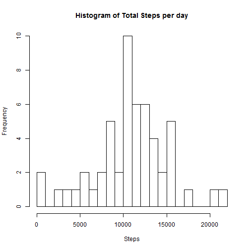
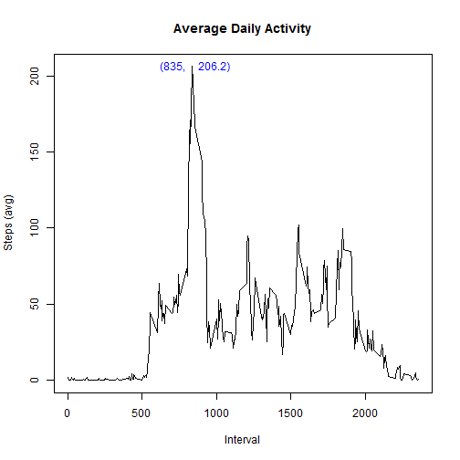
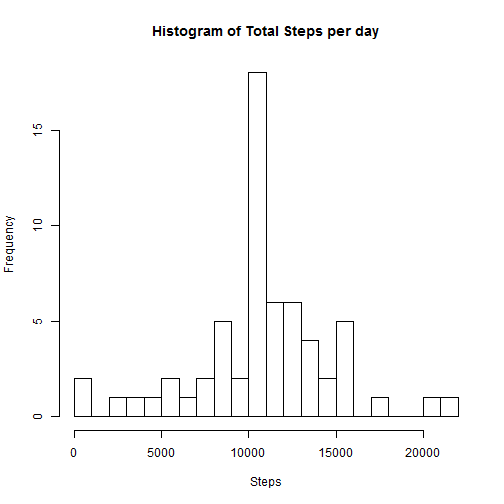
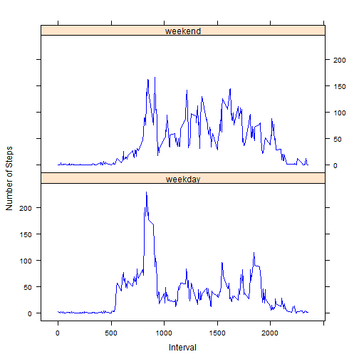

#Loading and preprocessing the data

1. Load the data (i.e. read.csv())
2. Process/transform the data (if necessary) into a format suitable for your analysis

```r
fn<-'activity.csv'
df<-read.csv(fn)
dim(df)
```

```
## [1] 17568     3
```

```r
str(df)
```

```
## 'data.frame':	17568 obs. of  3 variables:
##  $ steps   : int  NA NA NA NA NA NA NA NA NA NA ...
##  $ date    : Factor w/ 61 levels "2012-10-01","2012-10-02",..: 1 1 1 1 1 1 1 1 1 1 ...
##  $ interval: int  0 5 10 15 20 25 30 35 40 45 ...
```

```r
head(df)
```

```
##   steps       date interval
## 1    NA 2012-10-01        0
## 2    NA 2012-10-01        5
## 3    NA 2012-10-01       10
## 4    NA 2012-10-01       15
## 5    NA 2012-10-01       20
## 6    NA 2012-10-01       25
```

# What is mean total number of steps taken per day?
Ignoring the missing values in the dataset.

1. Calculate the total number of steps taken per day

```r
dfbyDate<-aggregate(steps~date, df, sum)
head(dfbyDate)
```

```
##         date steps
## 1 2012-10-02   126
## 2 2012-10-03 11352
## 3 2012-10-04 12116
## 4 2012-10-05 13294
## 5 2012-10-06 15420
## 6 2012-10-07 11015
```

2. Make a histogram of the total number of steps taken each day

```r
hist(dfbyDate$steps, breaks=20, main='Histogram of Total Steps per day', xlab='Steps')
```



3. Calculate and report the mean and median of the total number of steps taken per day

```r
mu<-mean(dfbyDate$steps)
medi<-median(dfbyDate$steps)

fsrm<-c('Raw Data:\n',
        'Mean of Steps: %0.1f\n',
        'Median of Steps: %0.1f'
        )
fsims<-sprintf( paste( fsrm, collapse=''), mu, medi )
cat(fsims)
```

```
## Raw Data:
## Mean of Steps: 10766.2
## Median of Steps: 10765.0
```


# What is the average daily activity pattern?

1. Make a time series plot (i.e. type = "l") of the 5-minute interval (x-axis) and 

The average number of steps taken, averaged across all days (y-axis)

```r
dfbyInterval<-aggregate(steps~interval, df, mean)
dfbyInterval$TimeSeriesSteps<-ts(dfbyInterval$steps)

tm<-max(dfbyInterval$steps)
Max5MinuteInterval<-dfbyInterval[tm==dfbyInterval$steps,]$interval

plot.ts(dfbyInterval$interval, dfbyInterval$TimeSeriesSteps, 
        type='l', 
        main='Average Daily Activity', 
        xlab='Interval', 
        ylab="Steps (avg)"
        )
text(Max5MinuteInterval+1, tm,  
     labels=sprintf('(%0.0f,',Max5MinuteInterval), 
     col='blue', 
     pos=2
     )
text(Max5MinuteInterval+1, tm,  
     labels=sprintf('%0.1f)',tm), 
     col='blue', 
     pos=4
     )
```



2. Which 5-minute interval, on average across all the days in the dataset, contains the maximum number of steps?


```r
print( sprintf('Maximum 5 minute interval: %0.1f with maximun value %0.1f',  Max5MinuteInterval, tm ) )
```

```
## [1] "Maximum 5 minute interval: 835.0 with maximun value 206.2"
```


# Imputing missing values

Note that there are a number of days/intervals where there are missing values (coded as NA). The presence of missing days may introduce bias into some calculations or summaries of the data.

1. Calculate and report the total number of missing values in the dataset 
    (i.e. the total number of rows with NAs)

```r
print( sprintf('The total number of NA values is: %0.1f', sum(is.na(df$steps)) ) )
```

```
## [1] "The total number of NA values is: 2304.0"
```

2. Devise a strategy for filling in all of the missing values in the dataset. 

The strategy does not need to be sophisticated. 
For example, you could use the mean/median for that day, or 
The mean for that 5-minute interval, etc.

    + Strategy
        + SKLearn default: mean on the axis.  Options: mean, median and most common value
        + This project will use the mean on the axis and use the Rounded mean. 
        + Consider time of day matters more than day of week
        + This project uses the interval as the axis.  
        + df is the dataframe with correct data
        + copy the data frame,  merge it, then update within the data frame


3. Create a new dataset that is equal to the original dataset but with the missing data filled in

```r
dfImputed<-df
dfImputed<-merge(dfImputed, dfbyInterval, by=c('interval','interval'), all.y=T)
dfImputed$steps <- ifelse(is.na(dfImputed$steps.x), 
                          as.integer(dfImputed$steps.y), 
                          round(dfImputed$steps.x)
                          )
head(dfImputed)
```

```
##   interval steps.x       date  steps.y TimeSeriesSteps steps
## 1        0      NA 2012-10-01 1.716981        1.716981     1
## 2        0       0 2012-11-23 1.716981        1.716981     0
## 3        0       0 2012-10-28 1.716981        1.716981     0
## 4        0       0 2012-11-06 1.716981        1.716981     0
## 5        0       0 2012-11-24 1.716981        1.716981     0
## 6        0       0 2012-11-15 1.716981        1.716981     0
```


4.Make a histogram of the total number of steps taken each day


```r
dfImputedbyDate<-aggregate(steps~date, dfImputed, sum)
head(dfImputedbyDate)
```

```
##         date steps
## 1 2012-10-01 10641
## 2 2012-10-02   126
## 3 2012-10-03 11352
## 4 2012-10-04 12116
## 5 2012-10-05 13294
## 6 2012-10-06 15420
```

#### Make a histogram of the total number of steps taken each day


```r
hist(dfImputedbyDate$steps, 
     breaks=20, 
     main='Histogram of Total Steps per day', 
     xlab='Steps'
     )
```



#### Calculate and report the mean and median total number of steps taken per day. 
    

```r
mu2<-mean(dfImputedbyDate$steps)
medi2<-median(dfImputedbyDate$steps)

fsim<-c('Imputed Data:\n',
        'Mean of Steps: %0.1f\n',
        'Median of Steps: %0.1f'
        )
fsims<-sprintf( paste( fsim, collapse=''), mu2, medi2 )
cat(fsims)
```

```
## Imputed Data:
## Mean of Steps: 10749.8
## Median of Steps: 10641.0
```
    
#### Do these values differ from the estimates from the first part of the assignment? 


```r
fsl2<-c('             |    Mean   |   Median \n',
        'Raw Data     |  %0.1f  |   %0.1f \n',
        'Imputed Data |  %0.1f  |   %0.1f \n',
        'Change in both cases:  Imputed is Lower' 
      )
fsl2s<-sprintf( paste(fsl2, collapse=''), mu, medi,  mu2, medi2)
cat(fsl2s)  #writeLines(fsl2s)
```

```
##              |    Mean   |   Median 
## Raw Data     |  10766.2  |   10765.0 
## Imputed Data |  10749.8  |   10641.0 
## Change in both cases:  Imputed is Lower
```


#### What is the impact of imputing missing data on the estimates of the total daily number of steps?
        
    + Histogram bins with larger means increase more than bins with low means
    + But the relative size of bins seems in general - preserved. 


# Weekdays and Weekends
Are there differences in activity patterns between weekdays and weekends?

For this part the weekdays() function may be of some help here. 
Use the dataset with the filled-in missing values for this part.

1. Create a new factor variable in the dataset with two levels 
    - "weekday" and "weekend" indicating whether a given date is a weekday or weekend day

```r
sWeekday<-'weekday'
sWeekend<-'weekend'
require(timeDate)
```

```
## Loading required package: timeDate
```

```r
dfImputed$wd_or_we <- ifelse( isWeekday(as.Date(dfImputed$date)), 
                          sWeekday, 
                          sWeekend
                          )
head(dfImputed)
```

```
##   interval steps.x       date  steps.y TimeSeriesSteps steps wd_or_we
## 1        0      NA 2012-10-01 1.716981        1.716981     1  weekday
## 2        0       0 2012-11-23 1.716981        1.716981     0  weekday
## 3        0       0 2012-10-28 1.716981        1.716981     0  weekend
## 4        0       0 2012-11-06 1.716981        1.716981     0  weekday
## 5        0       0 2012-11-24 1.716981        1.716981     0  weekend
## 6        0       0 2012-11-15 1.716981        1.716981     0  weekday
```


2. Make a panel plot containing a time series plot of the 5-minute interval (x-axis) and 

(type = "l"),the average number of steps taken, averaged across all weekday days or weekend days (y-axis). 

See the README file in the GitHub repository to see an example of what this plot should look like using simulated data.

```r
dft<-aggregate(steps~interval+wd_or_we, dfImputed, mean)

dfImputed$TimeSeriesSteps<-ts(dfImputed$steps)
dft$steps<-ts(dft$steps)

require('lattice')
```

```
## Loading required package: lattice
```

```r
xyplot(steps ~ interval | wd_or_we,
       data = dft,
       xlab='Interval',
       ylab='Number of Steps',
       type = "l",
       col.line = "blue",
       layout=c(1,2)
       )
```




#### end
